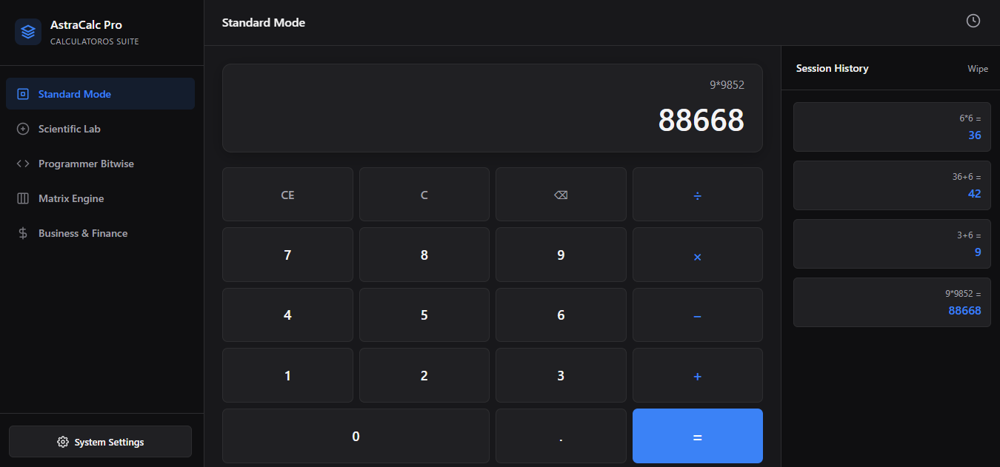
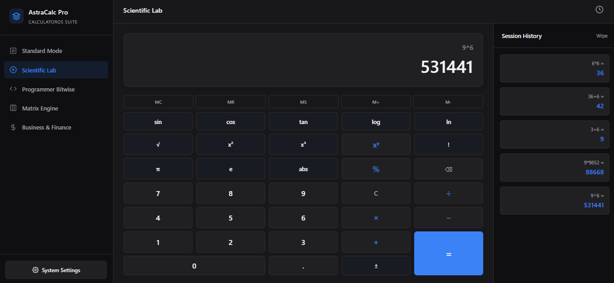
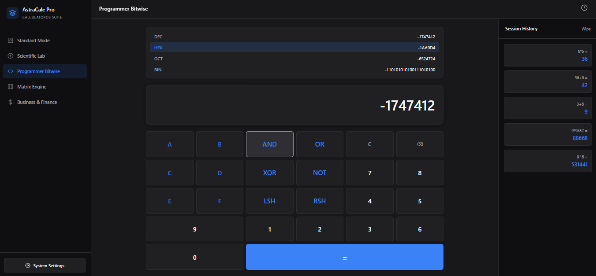
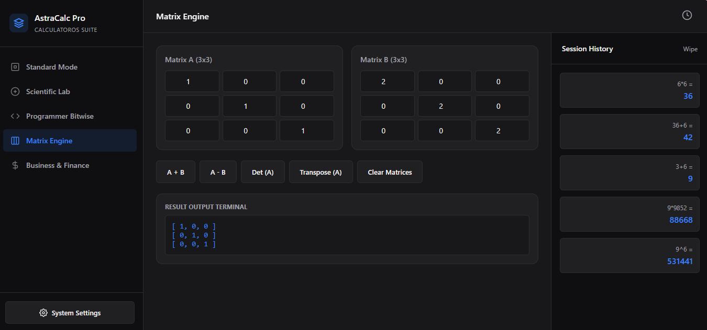
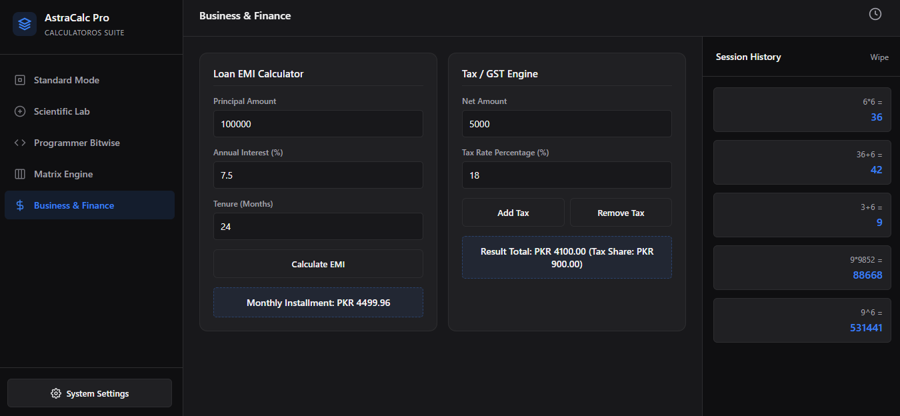
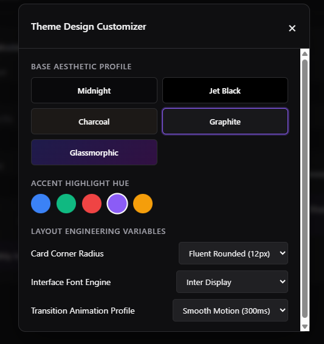

<div align="center">

# 🚀 AstraCalc Pro

### Next-Generation Multi-Mode Calculator Suite

*A premium desktop-inspired calculator application built with HTML5, CSS3 and Vanilla JavaScript.*


---

### 💼 Oasis Infobyte Internship

**Track:** Web Development & Designing

**Level:** 2

**Task:** Calculator

**Developed by:** **Mahnoor Yasir**

</div>

---

# 📖 Overview

AstraCalc Pro is a premium multi-mode calculator designed to provide much more than basic arithmetic.

The application combines multiple calculation systems into one modern desktop-inspired interface. Instead of relying on JavaScript's `eval()` function, it uses a manually designed mathematical expression parser to securely evaluate expressions.

The project focuses on clean architecture, modular development, responsive design, accessibility, and an intuitive user experience.

---

# ✨ Key Highlights

- 🎨 Modern Desktop UI
- 📱 Fully Responsive Design
- 🌙 Multiple Themes
- ⚡ Fast Performance
- 🧠 Manual Expression Parsing
- 🔒 No use of `eval()`
- 📊 Business Calculators
- 💻 Programmer Calculator
- 🧮 Scientific Calculator
- 🔢 Matrix Operations
- 📝 History System
- 💾 Memory Functions
- ⚙️ Customizable Interface

---

# 🚀 Features

## 🧮 Standard Calculator

- Basic Arithmetic
- Addition
- Subtraction
- Multiplication
- Division
- Decimal Support
- Percentage
- Continuous Calculations
- Backspace
- Clear Entry
- Clear All

---

## 🔬 Scientific Calculator

- Sine
- Cosine
- Tangent
- Logarithm
- Natural Log
- Square Root
- Square
- Cube
- Power
- Factorial
- Absolute Value
- Pi Constant
- Euler Constant
- Positive/Negative Toggle

---

## 💻 Programmer Mode

- Decimal
- Binary
- Octal
- Hexadecimal

Supports

- AND
- OR
- XOR
- NOT
- Left Shift
- Right Shift

---

## 📊 Matrix Engine

Supports

- Matrix Addition
- Matrix Subtraction
- Matrix Transpose
- Determinant
- Dynamic Matrix Rendering

---

## 💼 Business & Finance

### EMI Calculator

- Loan Amount
- Interest Rate
- Tenure
- Monthly Installment

### Tax Calculator

- Add Tax
- Remove Tax
- GST/VAT Calculations

---

## 💾 Memory Operations

- MC
- MR
- MS
- M+
- M-

---

## 📝 History

- Stores Calculations
- Reuse Previous Expressions
- Clear History

---

## 🎨 Theme Customization

Multiple Themes

- Midnight
- Jet Black
- Charcoal
- Graphite
- Glassmorphism

Accent Colors

- Blue
- Emerald
- Crimson
- Purple
- Gold

Additional Customization

- Font Style
- Animation Speed
- Border Radius

---

# 🏗️ Project Structure

```
WebDev-L2-Calculator
│
├── index.html
├── styles.css
├── app.js
└── README.md
```

---

# 🛠️ Technologies Used

| Technology | Purpose |
|------------|----------|
| HTML5 | Structure |
| CSS3 | Styling |
| Vanilla JavaScript | Application Logic |
| CSS Variables | Theme System |
| CSS Grid | Calculator Layout |
| Flexbox | Responsive Layout |

---

# 🔐 Engineering Highlights

- Manual Mathematical Parser
- Secure Evaluation Logic
- Modular JavaScript Architecture
- Event Driven Programming
- DOM Manipulation
- Responsive Components
- Dynamic Theme Engine
- Accessible Navigation
- Clean UI Architecture

---

# 📱 Responsive Design

The application works smoothly across

- Desktop
- Laptop
- Tablet
- Mobile Devices

---

# 🎯 Internship Requirements Covered

✅ Display Screen

✅ Numeric Buttons

✅ Decimal Support

✅ Arithmetic Operators

✅ Equals Operation

✅ Clear Button

✅ Backspace

✅ Division by Zero Handling

✅ Sequential Operations

✅ CSS Grid Layout

✅ Event Listeners

✅ Responsive Design

---

# 🌟 Additional Features Beyond Requirements

- Scientific Mode
- Programmer Mode
- Matrix Calculator
- EMI Calculator
- Tax Calculator
- Memory Register
- History Panel
- Theme Engine
- Accent Colors
- Keyboard Shortcuts
- Toast Notifications
- Settings Panel
- Glassmorphism Theme
- Dynamic UI Customization

---

# 📸 Screenshots

### 🧮 Standard Mode
The clean and intuitive interface for performing everyday arithmetic calculations.



---

### 🔬 Scientific Lab
Advanced mathematical functions including trigonometry, logarithms, exponents, and memory operations.



---

### 💻 Programmer Bitwise
Supports binary, octal, decimal, hexadecimal conversions and bitwise operations for developers.



---

### 🧩 Matrix Engine
Perform matrix addition, subtraction, transpose, determinant calculations, and other matrix operations.



---

### 💼 Business & Finance
Calculate Loan EMI, GST/Tax, and perform common financial calculations with ease.



---

### 🎨 Theme Design Customizer
Personalize the application with multiple themes, accent colors, fonts, animations, and layout settings.



---

# ▶️ How to Run

1. Download or Clone the repository.

```
git clone https://github.com/yourusername/OIBSIP.git
```

2. Open

```
WebDev-L2-Calculator
```

3. Double-click

```
index.html
```

or

Open with **Live Server** in Visual Studio Code.

---

# 🎓 Internship Information

**Organization**

Oasis Infobyte

**Track**

Web Development & Designing

**Level**

2

**Task**

Calculator

---

# 👩‍💻 Developer

**Mahnoor Yasir**

BS Computer Science

Web Development & Designing

GitHub:
https://github.com/mahnoor-yasir

---

<div align="center">

## ⭐ If you like this project, don't forget to star the repository.

Made with ❤️ using HTML, CSS & JavaScript.

</div>
