# TaskFlow - Interactive To-Do Web Application

A feature-rich, modern task management web application designed to help users organize daily schedules, track productivity analytics, and manage categorized workflows efficiently.

---

## Project Overview

TaskFlow is a client-side task management platform built to provide an intuitive interface for creating, filtering, organizing, and analyzing tasks. It supports complex task parameters including priority levels, categorized tags, due dates, recurring schedules, inline notes, and bulk actions. All application state persists locally using browser storage, ensuring data retainment without requiring backend authentication.

---

## Core Features

<table>
  <tr>
    <td width="50%">
      <h3>Task Creation & Management</h3>
      <p>Create tasks with custom titles, descriptions, due dates, priority tags (Low, Medium, High), categories, custom hashtags, and recurring options.</p>
    </td>
    <td width="50%">
      <h3>Dynamic Filtering & Views</h3>
      <p>Organize items by standard status filters (Today, Upcoming, Pending, Completed, Overdue, Archived) or view them filtered by custom categories.</p>
    </td>
  </tr>
  <tr>
    <td width="50%">
      <h3>Productivity Dashboard</h3>
      <p>Track performance metrics including completion percentage, streak counts, most productive days, average completion time, and weekly breakdown charts.</p>
    </td>
    <td width="50%">
      <h3>Bulk Batch Operations</h3>
      <p>Select multiple tasks simultaneously to perform batch completion, restoration, or deletion across lists.</p>
    </td>
  </tr>
  <tr>
    <td width="50%">
      <h3>Data Portability & Settings</h3>
      <p>Export application data to JSON files, import external data backups, generate clean print/PDF layouts, and customize accent themes or font sizes.</p>
    </td>
    <td width="50%">
      <h3>Theme Support & Persistence</h3>
      <p>Seamless toggle between Light and Dark visual modes with full layout persistence via local storage.</p>
    </td>
  </tr>
</table>

---

## Application Showcase & Visual Tour

Below is the complete visual documentation of all application views, modals, and settings.

### Core Views

<div align="center">
  <table>
    <tr>
      <td align="center" width="50%">
        <b>01. All Tasks View</b><br/><br/>
        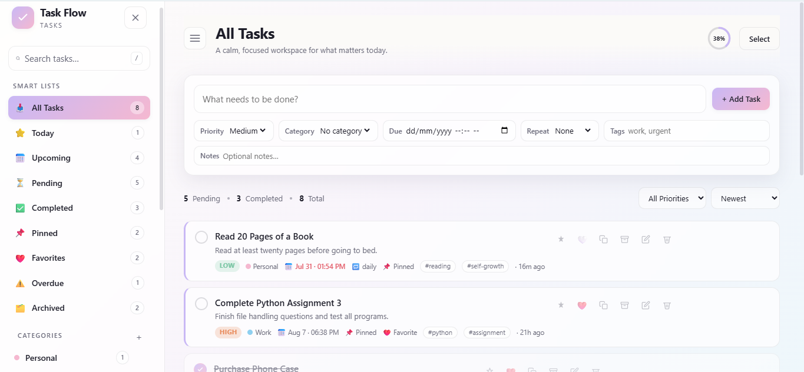
      </td>
      <td align="center" width="50%">
        <b>02. Today View</b><br/><br/>
        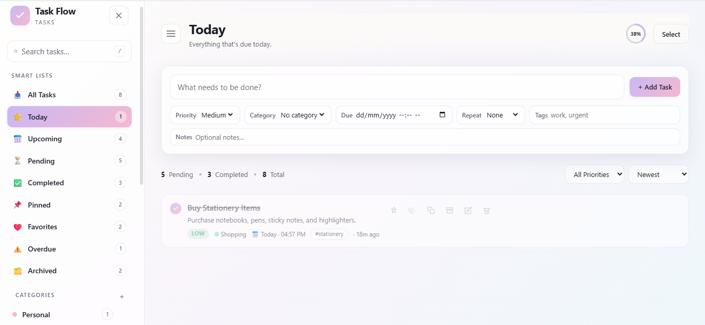
      </td>
    </tr>
    <tr>
      <td align="center" width="50%">
        <b>03. Upcoming View</b><br/><br/>
        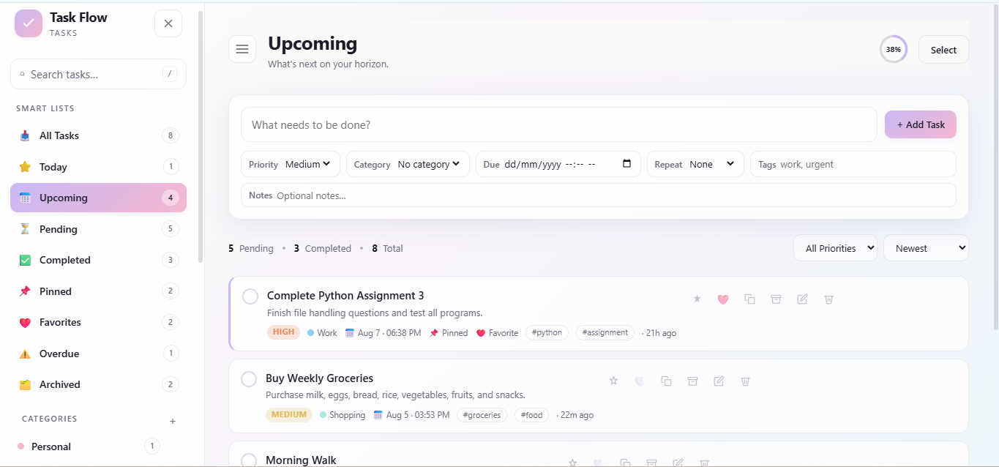
      </td>
      <td align="center" width="50%">
        <b>04. Pending View</b><br/><br/>
        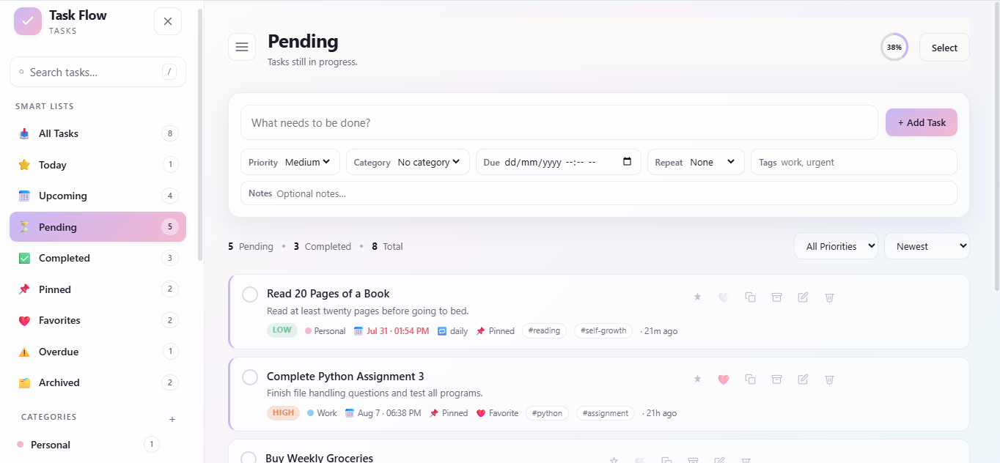
      </td>
    </tr>
    <tr>
      <td align="center" width="50%">
        <b>05. Completed View</b><br/><br/>
        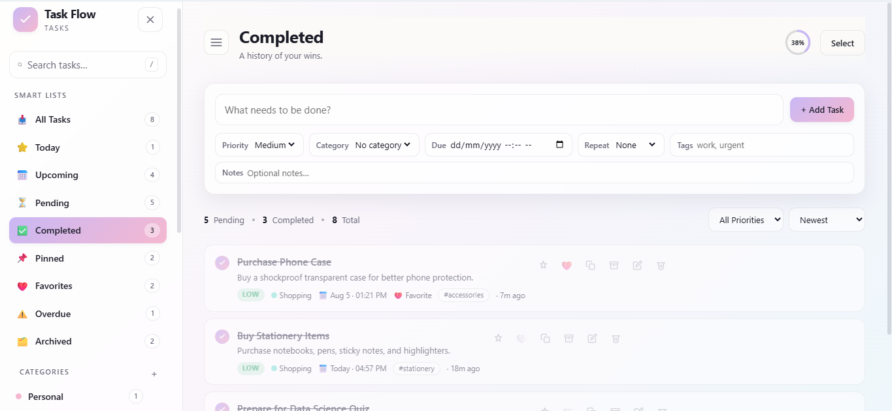
      </td>
      <td align="center" width="50%">
        <b>06. Pinned View</b><br/><br/>
        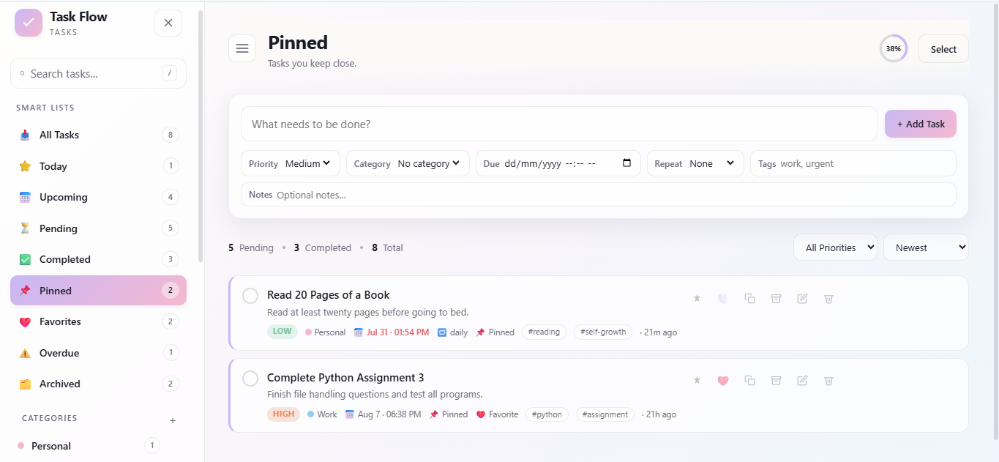
      </td>
    </tr>
    <tr>
      <td align="center" width="50%">
        <b>07. Favorites View</b><br/><br/>
        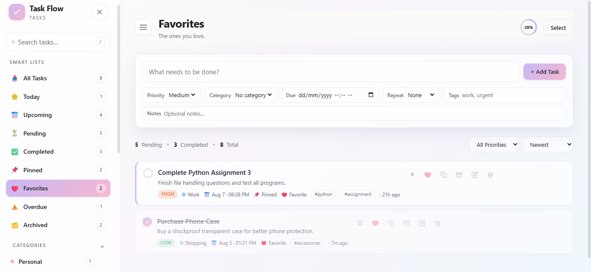
      </td>
      <td align="center" width="50%">
        <b>08. Overdue View</b><br/><br/>
        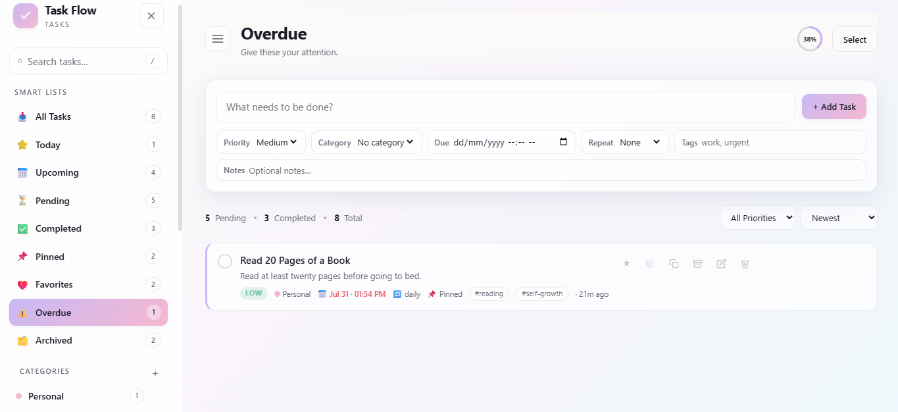
      </td>
    </tr>
    <tr>
      <td align="center" width="50%" colspan="2">
        <b>09. Archived View</b><br/><br/>
        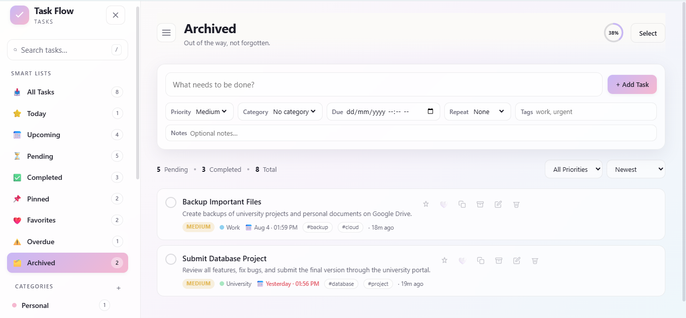
      </td>
    </tr>
  </table>
</div>

### Category Views

<div align="center">
  <table>
    <tr>
      <td align="center" width="50%">
        <b>10. Personal Category</b><br/><br/>
        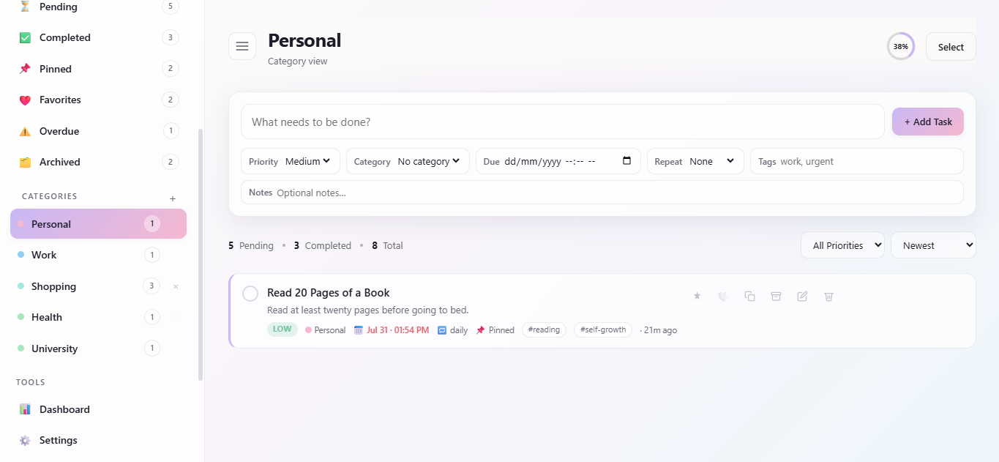
      </td>
      <td align="center" width="50%">
        <b>11. Work Category</b><br/><br/>
        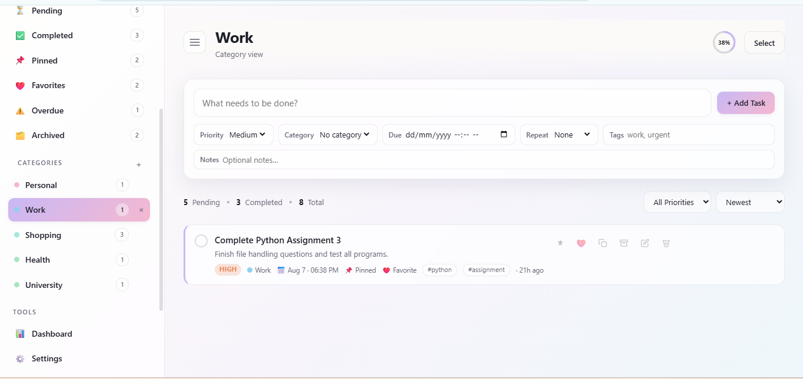
      </td>
    </tr>
    <tr>
      <td align="center" width="50%">
        <b>12. Shopping Category</b><br/><br/>
        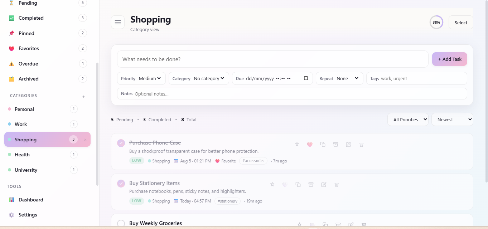
      </td>
      <td align="center" width="50%">
        <b>13. Health Category</b><br/><br/>
        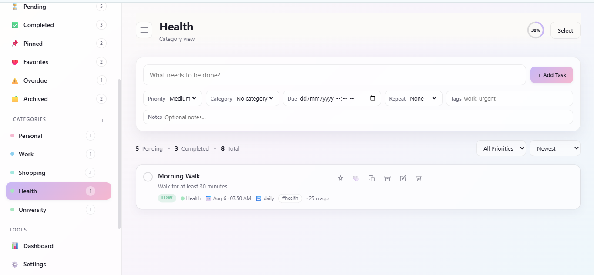
      </td>
    </tr>
    <tr>
      <td align="center" width="50%" colspan="2">
        <b>14. University Category</b><br/><br/>
        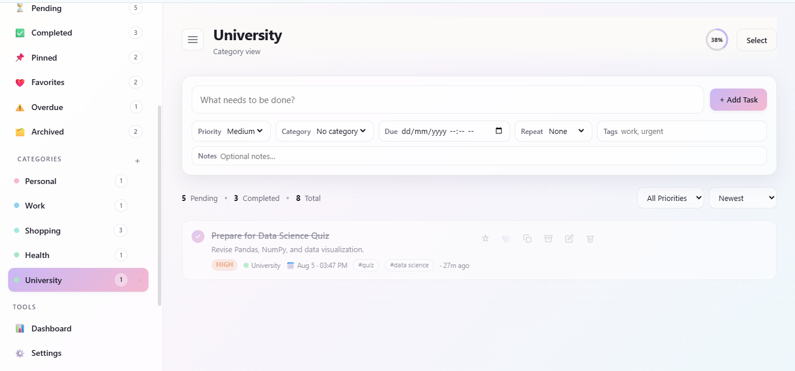
      </td>
    </tr>
  </table>
</div>

### Modals, Tools, and Customization

<div align="center">
  <table>
    <tr>
      <td align="center" width="50%">
        <b>15. Edit Task Modal</b><br/><br/>
        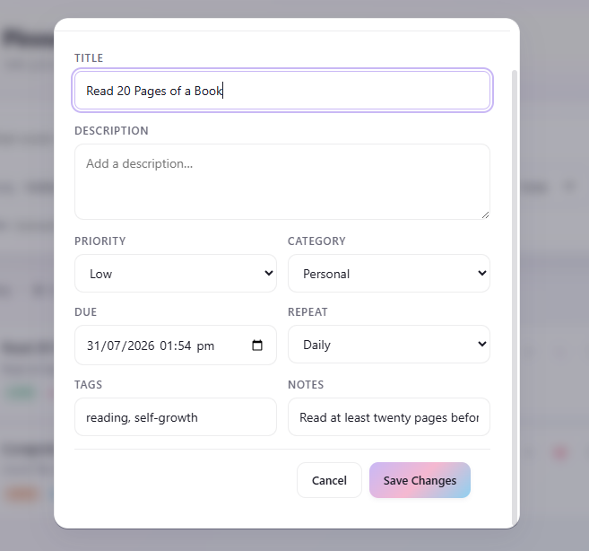
      </td>
      <td align="center" width="50%">
        <b>16. Bulk Action Selection</b><br/><br/>
        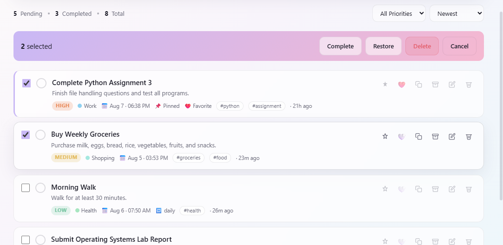
      </td>
    </tr>
    <tr>
      <td align="center" width="50%">
        <b>17. Productivity Dashboard</b><br/><br/>
        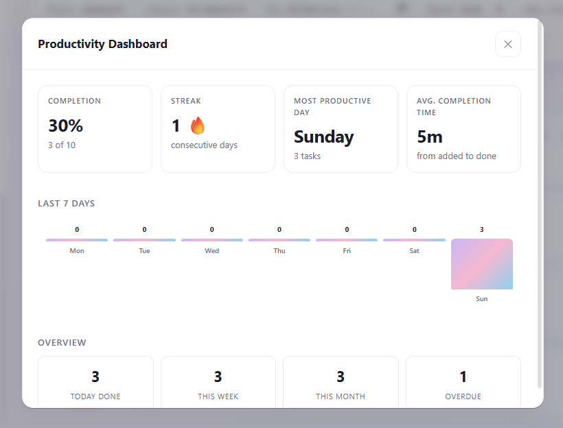
      </td>
      <td align="center" width="50%">
        <b>18. Settings Modal</b><br/><br/>
        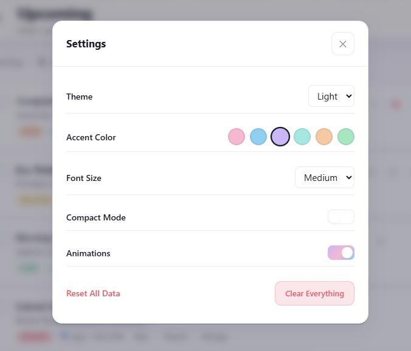
      </td>
    </tr>
    <tr>
      <td align="center" width="50%">
        <b>19. Tools Sidebar Menu</b><br/><br/>
        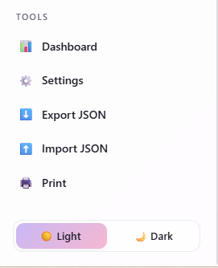
      </td>
      <td align="center" width="50%">
        <b>20. Print / Export PDF Preview</b><br/><br/>
        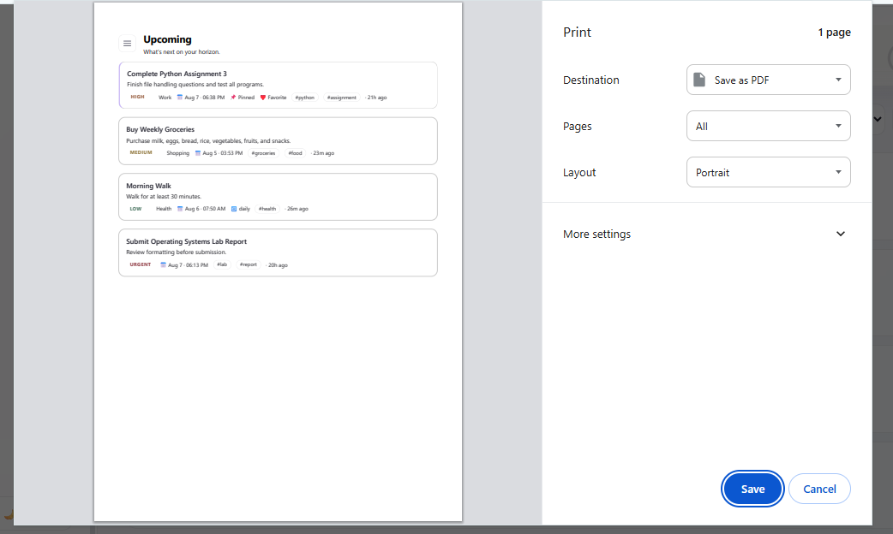
      </td>
    </tr>
    <tr>
      <td align="center" width="50%" colspan="2">
        <b>21. Dark Mode Theme</b><br/><br/>
        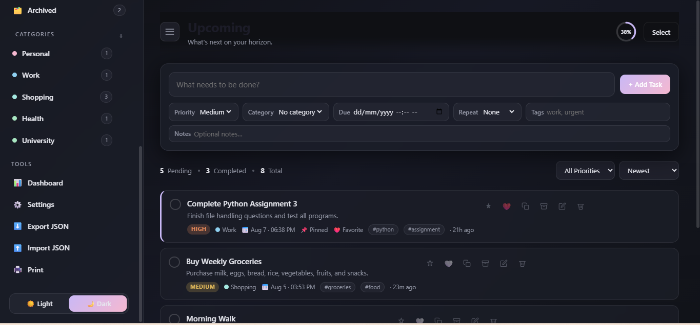
      </td>
    </tr>
  </table>
</div>

---

## Technical Architecture

### Tech Stack

- **Frontend Structure:** HTML5 (Semantic Layout)
- **Styling:** CSS3 (Flexbox, CSS Grid, Custom Variables, Dynamic Themes)
- **Scripting:** JavaScript (Vanilla ES6+ DOM Manipulation)
- **Data Storage:** Web Storage API (`localStorage`)

### Project Structure

```text
WebDev-L2-To-DoWebApp/
│
├── assets/
│   └── images/
│       ├── 01-task-flow-all-tasks-view.png
│       ├── 02-task-flow-today-view.png
│       ├── 03-task-flow-upcoming-view.png
│       ├── 04-task-flow-pending-view.png
│       ├── 05-task-flow-completed-view.png
│       ├── 06-task-flow-pinned-view.png
│       ├── 07-task-flow-favorites-view.png
│       ├── 08-task-flow-overdue-view.png
│       ├── 09-task-flow-archived-view.png
│       ├── 10-task-flow-category-personal-view.png
│       ├── 11-task-flow-category-work-view.png
│       ├── 12-task-flow-category-shopping-view.png
│       ├── 13-task-flow-category-health-view.png
│       ├── 14-task-flow-category-university-view.png
│       ├── 15-task-flow-edit-task-modal.png
│       ├── 16-task-flow-bulk-action-selection.png
│       ├── 17-task-flow-productivity-dashboard.png
│       ├── 18-task-flow-settings-modal.png
│       ├── 19-task-flow-tools-sidebar-menu.png
│       ├── 20-task-flow-print-preview-view.png
│       └── 21-task-flow-dark-mode-theme.png
│
├── index.html
├── script.js
├── style.css
└── README.md
